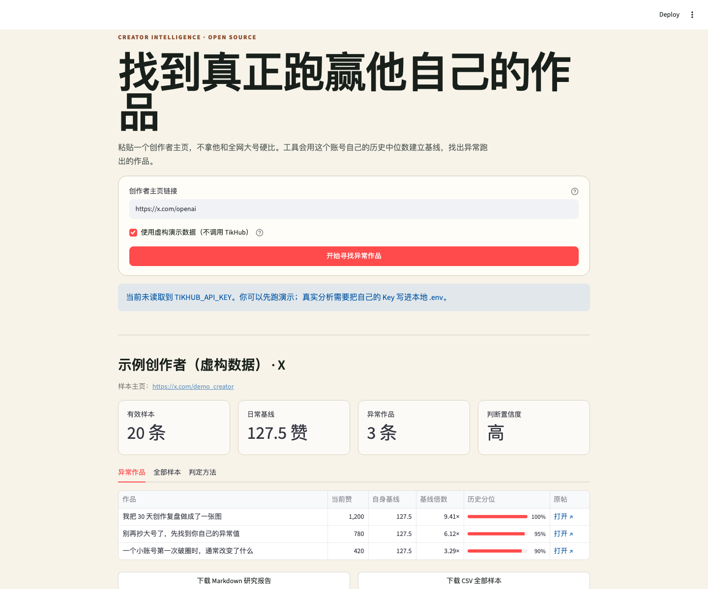

# Creator Breakout Finder

粘贴一个创作者主页链接，找到真正跑赢他自己的作品。

[](https://github.com/guasi18587278913/creator-breakout-finder/actions/workflows/ci.yml)
[](https://www.python.org/)
[](LICENSE)



## 为什么做这个工具

研究对标账号时，只看播放量或点赞量很容易被账号体量骗到。一个大号的 10 万赞，可能只是日常发挥；一个小号的 2,000 赞，却可能是一次值得拆解的异常突破。

Creator Breakout Finder 不拿不同账号横向硬比。它读取一个账号最近的公开作品，用这个账号自己的历史中位数建立基线，再找出显著高于其日常水平的作品。

## 能做什么

- 识别小红书、抖音、B站、TikTok、YouTube 和 X 的完整创作者主页链接
- 通过用户自己的 [TikHub](https://docs.tikhub.io/) Key 读取最近公开作品
- 用中位数建立账号自身基线，降低少数超级爆款对基线的干扰
- 同时检查基线倍数、历史分位和绝对量下限，减少小样本误报
- 展示判断置信度，并导出 Markdown 研究报告和 CSV 全量样本
- 内置完全离线的虚构演示数据，不配置 Key 也能体验完整流程

## 快速开始

需要 Python 3.11+ 和 [uv](https://docs.astral.sh/uv/)。

```bash
git clone https://github.com/guasi18587278913/creator-breakout-finder.git
cd creator-breakout-finder
uv sync --extra dev
uv run streamlit run app.py
```

没有配置 Key 时，页面会默认使用虚构演示数据。也可以直接打开：

```text
http://localhost:8501/?demo=1
```

要分析真实账号，把示例环境文件复制为本地 `.env`，然后填入你自己的 Key：

```bash
cp .env.example .env
uv run streamlit run app.py
```

```dotenv
TIKHUB_API_KEY=你的_TikHub_Key
```

`.env` 已被 Git 忽略，不要把真实 Key 写进源码、截图、Issue 或提交记录。

## 支持的主页链接

| 平台 | 示例 | 用于判断的指标 |
| --- | --- | --- |
| 小红书 | `https://www.xiaohongshu.com/user/profile/{user_id}` | 点赞 |
| 抖音 | `https://www.douyin.com/user/{sec_user_id}` | 点赞 |
| B站 | `https://space.bilibili.com/{uid}` | 播放 |
| TikTok | `https://www.tiktok.com/@{handle}` | 点赞 |
| YouTube | `https://www.youtube.com/@{handle}` 或 `/channel/{id}` | 播放 |
| X | `https://x.com/{handle}` | 点赞 |

工具有意拒绝作品链接、短链接、非 HTTPS 链接和带账号密码或自定义端口的 URL。TikHub 接口及各平台数据可用性会随服务商和平台变化；这个项目不绕过登录、隐私设置或平台访问限制。

## 爆款怎么判断

默认分析最近 30 条带有效指标的作品，至少需要 5 条样本；X 的纯转推不会被当成账号自己的作品。候选作品必须同时满足：

1. 当前指标不低于账号历史中位数的 **2 倍**；
2. 当前指标进入这批样本的 **前 10%**；
3. 播放量不少于 **500**，或点赞量不少于 **20**。

样本数 5–9 条时置信度为低，10–19 条为中，20 条及以上为高。阈值集中在 [`scoring.py`](src/creator_breakout/scoring.py)，方便按自己的研究口径修改。

## 安全边界

- 仓库不内置作者或任何第三方的 TikHub Key；每位使用者都要自带 Key
- Key 只由服务端进程从本地环境变量读取，不进入浏览器表单和导出报告
- 客户端不会记录 Key，也不会在错误信息里回显 Key
- 原始接口响应只在内存中做标准化，不落盘
- 如果把应用公开部署到互联网，必须自行增加认证、调用配额和限流；否则访客可能消耗部署者的 API 额度

更多细节见 [SECURITY.md](SECURITY.md)。

## 局限

这是一次性历史快照，不是等龄增长曲线。旧作品天然有更长时间积累播放和互动，因此结果适合做“值得进一步研究的异常候选”，不能证明爆款原因，也不能等同于实时增长速度。私密、删除、接口未返回或缺少指标的作品不会进入样本。

## 开发与测试

```bash
uv sync --extra dev
uv run ruff check app.py src tests
uv run pytest
```

核心代码按职责拆开：

- `links.py`：严格解析和标准化主页链接
- `providers/tikhub.py`：BYOK TikHub 适配与六平台数据归一化
- `scoring.py`：创作者自身基线与异常作品判定
- `report.py`：Markdown 和 CSV 导出
- `app.py`：Streamlit 单页界面

## 贡献

欢迎提交 Issue 或 Pull Request。新增数据源时，请保持 BYOK、错误脱敏和不持久化原始响应这三个边界，并为新增平台响应补测试夹具。

## License

[MIT](LICENSE)
